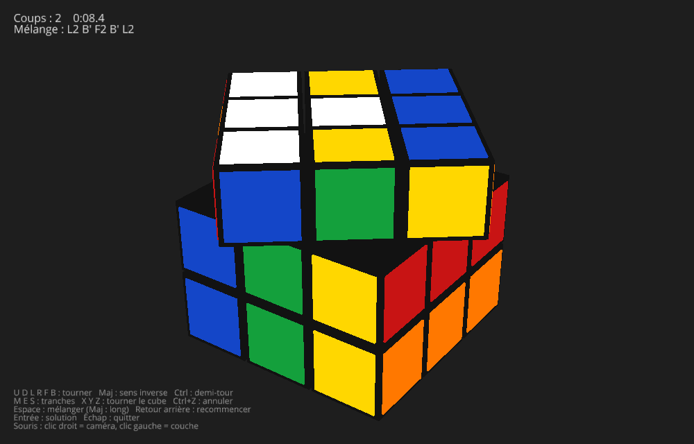
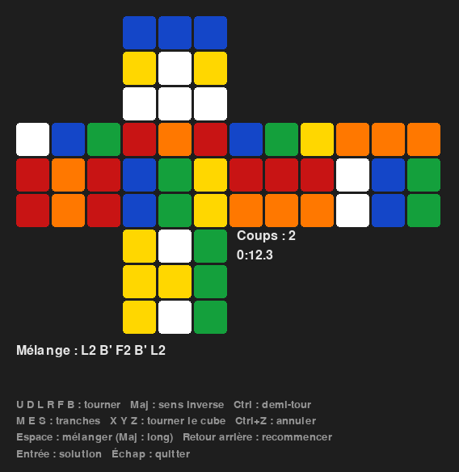
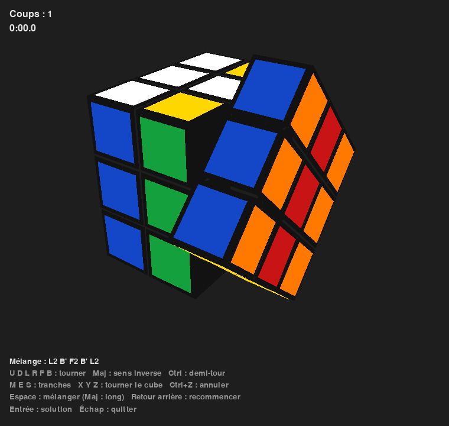

# rubiks-rl

Un Rubik's Cube 3x3 recréé en Python, jouable au clavier et à la souris dans une vue 3D, puis (bientôt) résolu par un agent de **reinforcement learning** (apprentissage par renforcement).

C'est un projet d'apprentissage : il sert à pratiquer Python, Git et le reinforcement learning, étape par étape. Le plan complet est décrit dans le [document de cadrage](docs/cadrage.md).

> **Avancement :** le jeu est fini (v1.0.0, phases 0 à 3). Prochaine étape : la phase 4, le cours de RL et l'environnement Gymnasium.



## Installation

### Prérequis

- [Git](https://git-scm.com/downloads)
- [uv](https://docs.astral.sh/uv/getting-started/installation/), le gestionnaire de projet Python. Pas besoin d'installer Python à part : uv télécharge lui-même la bonne version (3.12).

### Récupérer le projet

```bash
git clone https://github.com/leonardgst/rubiks-rl.git
cd rubiks-rl
uv sync
```

`uv sync` crée l'environnement virtuel `.venv/` et y installe les versions exactes des dépendances, listées dans `uv.lock`.

## Jouer

| Commande | Ce qui s'ouvre |
|---|---|
| `uv run rubiks` | le jeu en 3D (ursina) : caméra à la souris, faces animées |
| `uv run rubiks-2d` | le patron déplié en 2D (pygame) |
| `uv run rubiks-3d-pygame` | la 3D calculée « à la main », sans bibliothèque 3D (pygame) |
| `uv run rubiks-terminal` | le cube en couleurs dans le terminal (on tape les mouvements) |

### Touches (toutes les fenêtres)

| Touche | Effet |
|---|---|
| `U` `D` `L` `R` `F` `B` | quart de tour horaire de la face (vue de l'extérieur) |
| `Maj` + lettre | sens inverse (`R'`) |
| `Ctrl` + lettre | demi-tour (`R2`) |
| `M` `E` `S` | tranches du milieu (M comme L, E comme D, S comme F) |
| `X` `Y` `Z` | tourner tout le cube (x comme R, y comme U, z comme F) |
| `Ctrl` + `Z` | annuler le dernier coup |
| `Espace` | mélanger (5 coups) ; `Maj` + `Espace` : long mélange (25 coups) |
| `Retour arrière` | revenir à un cube neuf |
| `Entrée` | jouer la solution, coup par coup |
| `Échap` | quitter |
| `F12` | capture d'écran (vues pygame) |

### Souris (vues 3D)

| Geste | Effet |
|---|---|
| clic gauche sur une case + glisser | tourner la couche dans ce sens |
| clic droit + glisser | tourner la caméra autour du cube (vue pygame : aussi clic gauche dans le vide) |
| molette | zoomer |

Le chrono démarre au premier coup après un mélange et s'arrête quand le cube est résolu. Les rotations `x y z` ne comptent pas comme des coups.

| 2D | 3D « à la main » |
|---|---|
|  |  |

## Organisation du code

```
src/rubiks/
├── moves.py          # notation : 18 mouvements de faces, tranches, rotations, inverse, simplification
├── scramble.py       # mélanges aléatoires (jamais deux fois la même face de suite)
├── geometry.py       # géométrie 3D : cubies, normales, rotations, permutations, glisser à la souris
├── cube.py           # la classe Cube : état (6, 3, 3), mouvements rapides (permutations)
├── game.py           # règles du jeu : touches, partie, chrono, annulation, file d'animation
└── render/
    ├── colors.py     # couleurs et textes partagés
    ├── view2d.py     # patron 2D (pygame)
    ├── view3d.py     # le jeu 3D (ursina)
    ├── scene.py      # la 3D « à la main » : projection, tri, sélection (calculs seuls)
    ├── view3d_pygame.py  # ... dessinée avec pygame
    └── terminal.py   # affichage en couleurs dans le terminal
```

Règle d'or : **la logique ne dépend jamais de l'affichage**. `cube.py`, `game.py`, `geometry.py`… n'importent ni pygame ni ursina (un test le vérifie). L'agent de RL pourra donc jouer des millions de coups sans rien afficher.

## Commandes utiles

| Commande | À quoi ça sert |
|---|---|
| `uv run pytest` | lancer les tests |
| `uv run ruff check .` | chercher les erreurs probables dans le code (linter) |
| `uv run ruff format .` | remettre le code en forme |
| `uv lock --check` | vérifier que `uv.lock` est à jour, sans rien modifier |

Les mêmes vérifications tournent sur GitHub à chaque push et chaque Pull Request (onglet *Actions*).

## Documentation

- [Document de cadrage](docs/cadrage.md) : objectifs, choix techniques, découpage en phases
- [Cours sur uv](docs/cours/uv.md)
- [Fiches récap](docs/fiches/), une par étape, et le [bilan de la v1.0](docs/fiches/bilan-v1.md)

## Licence

[MIT](LICENSE)
